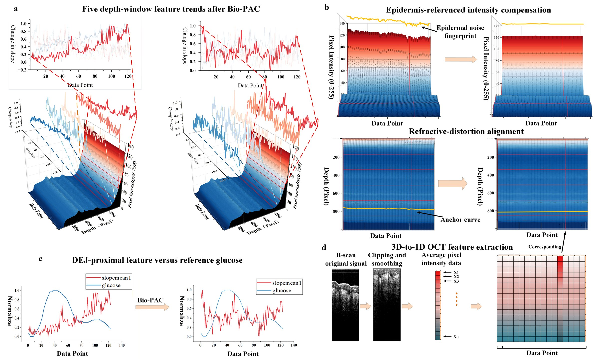

# Calibration-Equation-Free OCT-Based Blood Glucose Monitoring via Bio-PAC and TFT

This repository accompanies the manuscript:

**Calibration-Equation-Free OCT-Based Blood Glucose Monitoring with Bio-PAC and Temporal Fusion Transformer**

It is intended as a publication-oriented and peer-review reproducibility package,
providing the public implementation details needed to understand and verify the
main computational workflow reported in the paper. The repository is a
de-identified method package rather than a full clinical-data release.

The code implements the core computational components used in the paper:

- Biologically Informed Physical Alignment and Compensation (Bio-PAC)
- DEJ-guided dynamic signal-extraction rule discovery and application
- five-fold subject-wise prediction protocol with L0 = 10 and W = 50/H = 10
- distribution-aware autoregressive aggregation
- Figure 7 input-source and paired-trajectory control utilities
- Clarke error grid and regression-metric evaluation

The full clinical OCT-reference-blood-glucose dataset is not included because it contains human
measurements under institutional ethics and privacy restrictions. A small
anonymized/synthetic example is included to verify the code path.

## Repository Structure

```text
src/biopac_tft_oct/
  biopac.py          # morphology alignment and epidermis-referenced decoupling
  features.py        # DEJ-guided dynamic OCT signal extraction
  rule_discovery.py  # discovery-only DEJ-to-window mappings
  protocol.py        # L0, W/H, and five-fold subject-wise splits
  controls.py        # input-source and paired-trajectory control utilities
  aggregation.py     # dense candidate averaging for overlapping predictions
  metrics.py         # Clarke zones and regression metrics
scripts/
  run_demo.py        # runnable demo using anonymized/synthetic data
  evaluate_predictions.py
research_code/
  matlab/            # organized MATLAB code close to the internal Bio-PAC scripts
  python/            # organized subject-wise Darts workflow skeleton
tests/
  test_paper_protocol.py  # protocol and control-boundary checks
examples/
  demo_anonymized_sample.csv
  demo_predictions.csv
docs/
  assets/figure3_biopac.jpg
  biopac_workflow.md
  data_availability.md
  implementation_notes.md
```

## Installation

```bash
python -m venv .venv
.venv\Scripts\activate
pip install -r requirements.txt
```

The core Bio-PAC and evaluation demo requires only NumPy, pandas, and
matplotlib. Darts, PyTorch, and XGBoost are optional dependencies for full model
training and comparison workflows.

Optional training dependencies can be installed with:

```bash
pip install -r requirements-optional.txt
```

## Quick Demo

```bash
python scripts/run_demo.py
```

Expected output includes the corrected OCT matrix shape, DEJ window ranges,
feature matrix shape, regression metrics, and Clarke zone percentages.

## Data Format

For the clinical workflow, each session is represented as a minute-level time
series with columns similar to:

```text
date, glucose, slopmean1, slopmean2, slopmean3, slopmean4, slopmean5,
gender, age, diabetic_healthy, diabetic_t1, diabetic_t2, finger, arm
```

The five `slopmean` columns correspond to Bio-PAC-processed dynamic OCT
features. The `glucose` column is the reference blood glucose target. Static
covariates include age, sex, diabetes status, and measurement site.

For the manuscript workflow, the five features are not selected anew in the
prediction cohort. A separate 28-session, 21-participant rule-discovery cohort
establishes a frozen, site-specific mapping from OCT-derived DEJ depth to five
window centres. The mapping is then applied to the 72-session, 41-participant
prediction cohort from OCT morphology alone. The prediction-cohort reference
blood glucose trajectory is never used to reselect or adapt the windows.

`detect_first_peak_anchor()` detects the OCT-derived DEJ/first-peak anchor
after skipping the first 10 pixels and restricting the search to the expected
site-specific range. `fit_dej_guided_dynamic_signal_extraction_rule()` fits a
discovery-only mapping, and `dej_guided_dynamic_signal_features()` applies the
frozen mapping to a new session. The 11-pixel window definition is retained by
the default `half_width=5`.

## Study Protocol

The full study contains 100 OCT-OGTT sessions from 62 participants. The
rule-discovery cohort and prediction cohort are distinct. Prediction uses
five-fold subject-wise cross-validation: every participant is held out for
testing once, and all sessions from a participant remain within one partition
in each fold.

Two different historical lengths have different roles:

- `L0 = 10` initial reference blood glucose values initialise the model state.
- `W = 50` observed time points form the model input history, and `H = 10`
  is the forecast horizon.

Thus, no forecast is expected during the first 50 time points. This history
requirement is separate from the 10-point initial reference input. At inference,
future reference blood glucose is masked and future OCT is unavailable.

## Bio-PAC Summary

Bio-PAC processes the depth-time OCT signal `I(t, z)` before the temporal
predictor receives OCT covariates. The released code provides both an offline
batch function for reproducing saved-session analyses and a causal prefix
function for the sequential inference boundary described in the manuscript.
The causal path uses only the current and previously acquired OCT frames when
estimating compensation for a new time point; it does not use future OCT frames
or future glucose labels.

Bio-PAC contains two stages:

1. **Morphology-aware refractive-distortion alignment** estimates segment-wise
   shifts by cross-correlating whole envelope segments and interpolates them
   into a continuous depth-warping field.
2. **Epidermis-referenced optical decoupling** averages superficial depth
   pixels into a standardized epidermal fingerprint `P(t)` and removes the
   depth-specific fitted component `alpha_z P(t)`.

This implementation follows the formula logic described in the manuscript.
Use `causal_biopac_process()` when auditing the no-future-OCT prediction path.
Use `biopac_process()` only for offline batch inspection of a saved OCT session.

The manuscript Figure 3 and a detailed step-by-step explanation of the Bio-PAC
computational workflow are available in
[`docs/biopac_workflow.md`](docs/biopac_workflow.md).



## Evaluation

For prediction CSV files with columns

```text
actual_glucose,tft_global_pred,transformer_global_pred,xgboost_global_pred,tide_global_pred
```

run:

```bash
python scripts/evaluate_predictions.py path\to\predictions.csv
```

Reference blood glucose values are assumed to be in mmol/L. Clarke error grid
classification is computed after conversion to mg/dL.

A small synthetic prediction example is provided:

```bash
python scripts/evaluate_predictions.py examples\demo_predictions.csv
```

The Figure 7 control helpers are available in `biopac_tft_oct.controls`. The
paired physiological trajectory stress test deliberately reorders matched
OCT-reference-blood-glucose pairs within a session while leaving explicit Time
and static covariates unchanged. It tests reliance on the original OGTT time
template without claiming to break the OCT-reference-blood-glucose pair itself.

Important implementation differences between the original internal research
code and this public de-identified package are summarized in
[`docs/implementation_notes.md`](docs/implementation_notes.md).

Organized versions of the original research scripts are provided in
[`research_code/`](research_code/). These files preserve the main internal
algorithmic steps while removing clinical data, absolute paths, generated
outputs, and cache files.

## Data Availability

The clinical OCT-glucose data are not publicly released because of institutional
ethics and privacy restrictions. See `docs/data_availability.md`.

## Citation

If you use this code, please cite the associated manuscript once available.

## License

This project is released under the MIT License.
