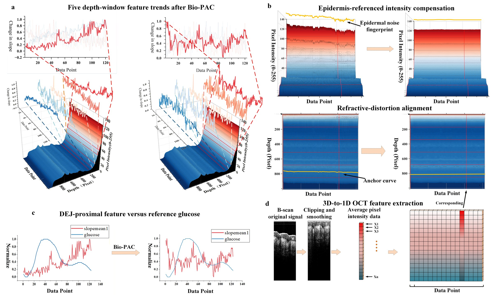

# Bio-PAC Computational Workflow

This document explains the Bio-PAC preprocessing logic used in the manuscript
figure below. The goal is to make the signal path readable without exposing the
private clinical OCT-glucose dataset.



## Input and Output

**Input.** Bio-PAC starts from raw OCT volumetric measurements `V_t` collected at
successive time points. In the manuscript experiments, one time point
corresponds to one approximately 1-min acquisition.

After B-scan preprocessing, surface flattening, lateral cropping, and averaging,
each time point is represented as one depth-intensity A-scan:

```text
I(t, z)
```

where `t` is the acquisition index along the time axis and `z` is the OCT depth
pixel. The value of `I(t, z)` is the backscattered OCT intensity at that time
and depth. In Figure 3, the depth axis is expressed in pixels; one pixel
corresponds to approximately 5.8574 micrometers.

**Output.** The output is a Bio-PAC-corrected depth-time OCT signal and the
derived DEJ-anchored dynamic OCT features used as covariates for TFT.

## Step 1: Preprocess OCT Volumes into Depth-Time Signals

For each acquisition time point, the OCT volume is flattened at the skin surface
and laterally averaged to suppress unstable lateral texture. This converts the
3-D OCT volume into a 1-D depth-intensity A-scan. The A-scans from all
acquisition times are then stacked along the time axis to form `I(t, z)`.

This representation keeps two important dimensions explicit:

- Along the **depth axis**, each curve is an OCT intensity profile through skin
  layers.
- Along the **time axis**, each fixed-depth curve describes how OCT intensity at
  the same depth pixel changes during the OGTT session.

## Step 2: Morphology-Aware Refractive-Distortion Alignment

The OCT depth coordinate is an apparent optical depth. During glucose dynamics
and probe-skin interaction, refractive-index and contact-state changes can make
the same anatomical layer appear at slightly different depth pixels over time.
If not corrected, a fixed pixel index may mix different tissue layers.

Bio-PAC aligns the depth morphology before optical compensation:

1. Each A-scan `I(t, z)` is compared with a reference A-scan.
2. The depth axis is divided into segments.
3. For each segment, Bio-PAC computes the shift that maximizes the correlation
   between the whole structural envelope of the current segment and the
   corresponding reference segment. The correlation is therefore computed over
   the whole segment curve, not only at isolated local extrema.
4. Segment shifts are interpolated into a continuous depth-warping field
   `Delta_t(z)`.
5. The A-scan is resampled using this field to obtain `I_align(t, z)`.

The warping changes the depth coordinate, not the raw intensity values
themselves. When one segment is shifted, neighboring intervals are smoothly
stretched or compressed so that the full depth axis remains continuous.

Implementation entry point:

```python
from biopac_tft_oct.biopac import morphology_align

aligned, shifts = morphology_align(
    oct_signal,
    n_segments=10,
    max_shift=30,
)
```

## Step 3: Epidermis-Referenced Optical Decoupling

Superficial epidermal OCT intensity often contains common-mode fluctuations
caused by contact pressure, temperature drift, surface coupling, and motion.
These components may look correlated with glucose during OGTT but are not
specific glucose responses.

Bio-PAC uses the epidermis as a reference pseudo-signal:

1. The superficial depth range is averaged along depth to obtain an epidermal
   temporal fingerprint:

   ```text
   N_epi(t) = mean_z I_align(t, z), z in superficial epidermal depths
   ```

2. `N_epi(t)` is standardized into a dimensionless reference pattern `P(t)`.
   In the released implementation this is z-score standardization, meaning zero
   mean and unit standard deviation, rather than min-max scaling.

3. For each depth pixel `z`, Bio-PAC fits a one-dimensional regression along the
   time axis:

   ```text
   I_align(t, z) = alpha_z P(t) + beta_z + epsilon_z(t)
   ```

   Here, `alpha_z P(t)` is the depth-specific contribution of the epidermal
   pseudo-signal, `beta_z` is the depth baseline, and `epsilon_z(t)` is the
   residual depth-specific temporal signal after removing the common superficial
   drift.

4. Bio-PAC subtracts only the fitted epidermal component:

   ```text
   I_corr(t, z) = I_align(t, z) - alpha_z P(t)
   ```

Because `alpha_z` is estimated separately for each depth, the same epidermal
fingerprint can be removed with depth-specific strength. This avoids applying a
single global subtraction coefficient to all tissue layers.

Implementation entry point:

```python
from biopac_tft_oct.biopac import epidermis_referenced_decoupling

corrected, fingerprint, alpha = epidermis_referenced_decoupling(
    aligned,
    epidermis_depth=10,
)
```

## Step 4: DEJ-Anchored Dynamic OCT Features

After Bio-PAC correction, the corrected depth-time signal is summarized into
five depth windows anchored around the dermal-epidermal junction (DEJ). These
windows are used as dynamic OCT covariates for the temporal model.

The public code supports two anchor modes. By default, it automatically detects
the first depth-axis intensity peak after skipping the first 10 pixels. To
avoid selecting an unrelated structural peak, the search is restricted to the
expected site-specific DEJ range. The default pixel ranges are:

```text
arm/wrist: 27-45 pixels
finger:    55-75 pixels
```

These ranges are based on the manuscript Fig. 4 and the 5.8574 micrometer/pixel
depth spacing. A manually supplied `dej_index` is also supported and takes
precedence over automatic detection. Once the automatic or manual anchor is
available, the five windows are repositioned by relative offsets:

```text
c_j = anchor + offset_j
W_j = [c_j - 5, c_j + 5]
```

Thus, when the DEJ is deeper or shallower in a subject or measurement site, all
five window locations move with the DEJ anchor rather than staying at fixed
surface-based pixel indices.

Implementation entry point:

```python
from biopac_tft_oct.features import dej_anchored_features, dej_anchored_window_ranges

features, windows = dej_anchored_features(
    corrected,
    site="wrist",
    offsets=(20, 40, 60, 80, 100),
    half_width=5,
)
```

Manual override remains available when the DEJ/first-peak anchor has been
determined outside this function:

```python
features, windows = dej_anchored_features(
    corrected,
    dej_index=32,
    offsets=(20, 40, 60, 80, 100),
    half_width=5,
)
```

For example, with the same offsets and an 11-pixel window width:

```python
dej_anchored_window_ranges(dej_index=18, n_depth=160)
dej_anchored_window_ranges(dej_index=26, n_depth=160)
```

the second call shifts all five depth windows eight pixels deeper.

The resulting feature matrix has shape:

```text
(time points, 5 OCT windows)
```

## Step 5: TFT-Based Conditional Prediction

The Bio-PAC-derived dynamic OCT features are combined with static subject
information, such as age, sex, diabetes status, and measurement site. A short
initial glucose reference history is used only to initialize the temporal state;
it does not fit a subject-specific OCT regression equation.

This distinction is central to the calibration-free setting:

- Traditional calibration fits an individual model or regression equation for
  each subject.
- The proposed framework uses a shared model and uses the initial reference only
  as a starting temporal state for subsequent OCT-conditioned prediction.

## Run the Demo

The demo uses anonymized/synthetic data and verifies the public code path:

```bash
python scripts/run_demo.py
```

Expected outputs include:

- corrected OCT matrix shape
- DEJ window ranges
- five-window feature matrix shape
- regression metrics
- Clarke zone percentages

For private clinical data, keep raw OCT volumes and identifiable subject
information outside the public repository. Convert each session into the
documented CSV feature format before model training or evaluation.
